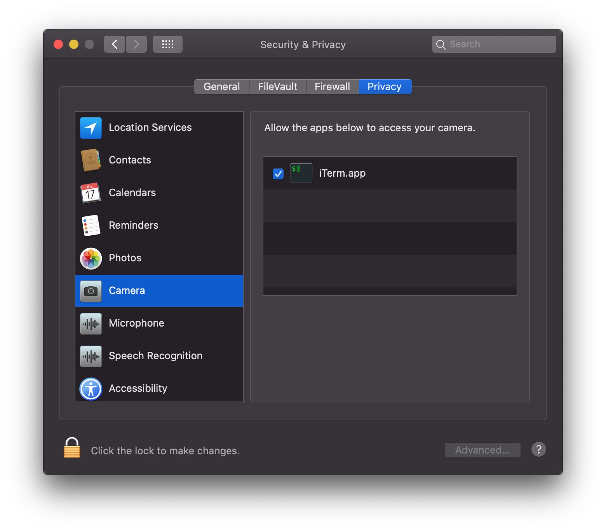

### About
This app can detect eye blinking. It also provides the recommended number of blinks over time.

### Support
- python 3.x
- macOS

### Usage
**Before running to application then check to installed `cmake` on your mac. If don't installed `cmake` then click link [Install cmake on Mac OSX](http://macappstore.org/cmake/)**

Install library

```bash
$ pip install -r requirements.txt
```

You can see the arguments with the `-h` command

```bash
$ python main.py -h

optional arguments:
  -h, --help            show this help message and exit
  -t THRESHOLD, --threshold THRESHOLD
                        threshold to determine close eyes
  -v [VERBOSE], --verbose [VERBOSE]
                        show frame on your face
```

Running application

```bash
$ python main.py
// if you want to see the frame
$ python main.py -v
```

And if the message `"terminal" would like to access the camera` opens, just allow it.

`System Preferences> Security & Privacy> Camera`.


